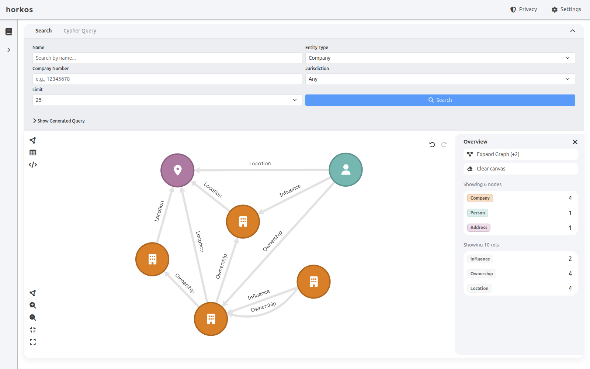

# Horkos Explorer

Horkos Explorer is a browser-based, read-only-by-default web UI for exploring
graph databases built by the [Horkos OSINT toolkit](https://github.com/domvwt/horkos).
The graphs hold entity-resolved UK corporate data — companies, people and
addresses drawn from UK Companies House and the Register of People with
Significant Control (PSC register) — with the matching results laid out for
research and note-taking.

It is a fork of [Kuzu Explorer](https://github.com/kuzudb/explorer), heavily
customised for safe public deployment.



## Quick start

Horkos Explorer is published as a Docker image. Mount a directory that contains
a Horkos-built `.kuzu` database at `/database`, name the file with `KUZU_FILE`,
and open [http://localhost:8000](http://localhost:8000):

```bash
docker run -p 8000:8000 \
  -v /path/to/data:/database \
  -e KUZU_FILE=graph.kuzu \
  --rm ghcr.io/domvwt/explorer:latest
```

The image ships safe, stateless defaults so no operator-supplied environment
variables are needed for a public deployment:

- `MODE=READ_ONLY` — the database is opened read-only and write queries are rejected.
- `DISABLE_SESSION_DB=true` — no server-side session storage; per-user state lives in the browser.
- `KUZU_QUERY_TIMEOUT=30000` — 30-second per-query wall-clock bound.
- `KUZU_QUERY_SIZE_LIMIT=10000` — maximum result rows returned per query.
- `CSP_REPORT_ONLY=false` — the Content-Security-Policy is enforced (not report-only).
- `KUZU_DIR=/database` — the mount point queried by default.

To enable write operations during local use, opt in to read-write mode:

```bash
docker run -p 8000:8000 \
  -v /path/to/data:/database \
  -e KUZU_FILE=graph.kuzu \
  -e MODE=READ_WRITE \
  --rm ghcr.io/domvwt/explorer:latest
```

## Configuration

Every variable below is read by the server; defaults are the effective values
when the variable is unset. One-line descriptions only — the rationale lives in
the code comments.

| Variable | Default | Effect |
| --- | --- | --- |
| `MODE` | `READ_ONLY` | Access mode: `READ_ONLY` or `READ_WRITE` (`DEMO` and `WASM` exist for in-browser demo builds). Unset or unrecognised values fail closed to `READ_ONLY`. |
| `KUZU_DIR` | `/database` (image) | Directory containing the `.kuzu` database file. |
| `KUZU_FILE` | `database.kz` | Database filename within `KUZU_DIR`. |
| `DUCKDB_FILE` | unset | Path to a DuckDB file with `search.*` tables; enables the `/api/suggest` autocomplete. Omit to disable it. |
| `KUZU_BUFFER_POOL_SIZE` | unset | Kuzu buffer pool size in bytes; when unset, Kuzu applies its own default sizing. |
| `KUZU_QUERY_TIMEOUT` | `30000` | Per-query wall-clock timeout in ms, applied to every pooled connection. |
| `KUZU_QUERY_SIZE_LIMIT` | `10000` | Maximum result rows returned per `/api/cypher` query. |
| `QUERY_ROW_BUDGET` | `100000` | Cumulative rows one IP may ship from `/api/cypher` per window. Enforced for every mode except `READ_WRITE`. |
| `QUERY_ROW_BUDGET_WINDOW_MS` | `86400000` | Row-budget window in ms (24h fixed window). |
| `RATE_LIMIT_WINDOW_MS` | `60000` | Time window for the general API rate limiter. |
| `RATE_LIMIT_MAX_REQUESTS` | `60` | Maximum general API requests per window per IP. |
| `QUERY_RATE_LIMIT_WINDOW_MS` | `60000` | Time window for the query rate limiter. |
| `QUERY_RATE_LIMIT_MAX_REQUESTS` | `30` | Maximum `/api/cypher` queries per window per IP. |
| `SUGGEST_RATE_LIMIT_WINDOW_MS` | `60000` | Time window for the autocomplete rate limiter. |
| `SUGGEST_RATE_LIMIT_MAX_REQUESTS` | `120` | Maximum `/api/suggest` requests per window per IP. |
| `TRUST_PROXY` | `1` | Reverse-proxy hops to trust for `X-Forwarded-For`. Normalised to a finite hop count; `false`/`0`/`off` disables. |
| `TRUST_PROXY_HOPS` | `1` | Hop count used when `TRUST_PROXY` is unset or `true`. |
| `JSON_BODY_LIMIT` | `1mb` | Maximum JSON request-body size. Multipart import uploads are not limited by this. |
| `DISABLE_SESSION_DB` | `true` (image) | Disable server-side session storage; per-user state stays in the browser. |
| `CSP_REPORT_ONLY` | `false` (image) | When `true`, the CSP is emitted report-only rather than enforced. Other security headers are always enforced. |

Development note: when `NODE_ENV=development` the rate limits and the row budget
are relaxed so hot-reloading does not trip them.

## Features

- **Entity search** with ranked autocomplete over companies, people and
  addresses. Autocomplete blends full-text ranking with prefix matching and is
  available when `DUCKDB_FILE` points at a search-table file.
- **Graph canvas** for visualising query results, with the ability to expand a
  selected node's neighbours and explore outward.
- **Notebooks** for saving notes and views. Notebook state is stored only in the
  browser's `localStorage` — nothing is written server-side.
- **Possible-match layer**: where the resolver considered two records the same
  entity but a rule rejected the merge, the relationship is drawn as a
  dashed, arrowless edge to a hub node whose label carries a `≈` prefix. These
  are match diagnostics, differentiated from real relationships rather than
  presented as facts.
- **Provenance**: each entity carries `source_records` identifiers tracing back
  to the underlying Companies House and PSC-register records, shown per source
  system in the entity panel.
- **External lookups** that open the current entity in Companies House,
  OpenCorporates, Google, Google News, Wikipedia and Google Maps.
- **Schema view** for browsing the node and relationship tables in the database.
- **Privacy notice** page, reachable from the header, presenting the UK GDPR
  Article 14 disclosure and a data-quality disclaimer.

## Security posture

The public image is built for an unauthenticated, read-only deployment over real
personal data:

- **Read-only, fail-closed mode.** The database is opened read-only and an unset
  or unrecognised `MODE` falls back to `READ_ONLY`.
- **Server-side query validation.** Incoming Cypher is checked against an
  allowlist before execution, so write and out-of-scope operations are rejected
  rather than relying on Kuzu alone.
- **Rate limits and a per-IP row budget.** Requests and queries are rate-limited
  per IP, and a cumulative row budget bounds how much of the graph one client
  can page out over time.
- **Result-size cap and query timeout.** Each response is capped in rows and each
  query has a wall-clock timeout, so no single query can stream the whole graph
  or run indefinitely.
- **Security headers.** [helmet](https://helmetjs.github.io/) sets a
  Content-Security-Policy, HSTS, anti-clickjacking, MIME-sniffing and
  referrer-policy headers at the application layer, as defence in depth behind
  any reverse proxy.
- **Stateless.** With `DISABLE_SESSION_DB=true` there is no server-side session
  store, so users are isolated and nothing per-user persists on the server.

## Development

Requirements: Node.js v20, [pnpm](https://pnpm.io/), JDK 11+ (for grammar
generation), a C++ toolchain, and Git.

```bash
# Install dependencies
pnpm install

# Download and compile Kuzu from source (git submodule; ~10 minutes)
git submodule update --init --recursive
npm run build-kuzu

# Generate the Cypher grammar (needs Java on PATH)
npm run generate-grammar
```

Run the development server with hot-reloading on
[http://localhost:8080](http://localhost:8080):

```bash
export MODE=READ_ONLY
export KUZU_DIR=/path/to/data
export KUZU_FILE=graph.kuzu
export JAVA_HOME=/path/to/jdk
export PATH=$JAVA_HOME/bin:$PATH

npm run serve
```

Lint and test:

```bash
npm run eslint       # check style
npm run eslint-fix   # auto-fix
npm run test         # run the vitest suite
```

## Releases

Releases are manual. Nothing builds or publishes on push; a release is cut by
dispatching the [Build-And-Deploy workflow](.github/workflows/build-and-deploy.yml)
from the Actions tab (or `gh workflow run Build-And-Deploy`). It builds and pushes
a multi-platform (`amd64` + `arm64`) image to GitHub Container Registry:

- A release dispatch publishes `ghcr.io/domvwt/explorer:latest` plus an immutable
  `:<YYYYMMDD>-<shortsha>` tag for pinning.
- Dispatching with `isNightly=true` publishes `:dev` instead.

The build renders the Article 14 privacy notice from six GitHub Actions
repository variables (`LEGAL_OPERATOR_NAME`, `LEGAL_CONTACT_EMAIL`,
`LEGAL_HOSTING_PROVIDER`, `LEGAL_HOSTING_REGION`, `LEGAL_EFFECTIVE_DATE`,
`LEGAL_REFRESH_CADENCE`). These are set once in repository settings and kept out
of source. If any is unset, the production build fails on the legal gate
(defined in `src/config/legal.config.js`, enforced from `vue.config.js`), so an
incomplete notice can never ship.

## Troubleshooting

**Kuzu submodule init hangs.** If `git submodule update --init --recursive`
stalls, reset and use a shallow clone:

```bash
git submodule deinit -f kuzu
rm -rf .git/modules/kuzu
git submodule update --init --depth 1
```

**Monaco editor font errors.** The project stays on the `monaco-editor` 0.39.x
line; a webpack error about a missing `codicon.ttf` means it has been upgraded
past that. Do not upgrade to v0.41.0+, which removes the embedded font.

**Grammar generation fails.** `generate-grammar` needs JDK 11 or newer on the
`PATH`; point `JAVA_HOME` at a suitable JDK and prepend `$JAVA_HOME/bin` to
`PATH`.

## Contributing

This is a purpose-built fork for the Horkos toolkit. Bug reports and small fixes
are welcome as issues or pull requests on this repository. Features for the
general-purpose explorer belong upstream in
[kuzudb/explorer](https://github.com/kuzudb/explorer).

For Cypher query syntax, see the [Kuzu documentation](https://docs.kuzudb.com).

## License

MIT, the same as upstream Kuzu Explorer. See [LICENSE](LICENSE).
